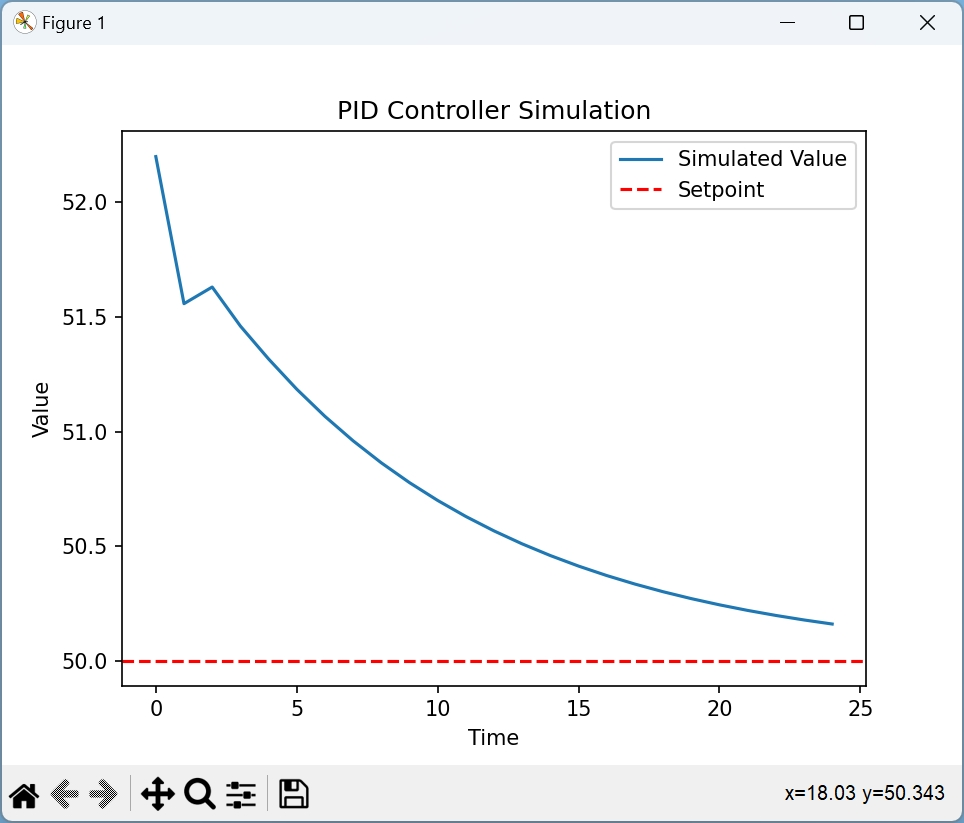

# PID Controler

## pid_controller_grafik.py

Dieses Python Script simuliert einen PID-Regler (Proportional-Integral-Differential) und seine Leistung mithilfe von Matplotlib visualisiert. Der Code erstellt ein einfaches interaktives Diagramm, um den Regelprozess während seiner Ausführung darzustellen. Dies kann Ihnen dabei helfen, zu verstehen, wie der PID-Regler auf Veränderungen im System reagiert.

Hier ist eine Aufschlüsselung dessen, was der Code tut:

1. **Bibliotheken importieren**: Der Code beginnt mit dem Importieren der benötigten Bibliotheken. Dazu gehört `matplotlib.pyplot` zum Erstellen von Diagrammen und `time` für eine kurze Verzögerung zwischen den Diagrammaktualisierungen.

2. **Klasse PIDController**: Der Code definiert eine Klasse `PIDController`, die einen PID-Regler implementiert. Der Konstruktor (`__init__`) initialisiert die Konstanten des Reglers (`kp`, `ki`, `kd`) sowie Variablen zur Speicherung des vorherigen Fehlers und des angesammelten Integralterms.

3. **Methode zur PID-Berechnung**: Die Methode `compute` der Klasse `PIDController` berechnet die Regelgröße basierend auf dem Fehler zwischen dem Sollwert und dem aktuellen Wert. Sie berechnet die proportionalen, integralen und differentiellen Terme und kombiniert sie dann, um die Regelgröße zu berechnen.

4. **Parameter einstellen**: Beispielwerte für die PID-Reglerkonstanten (`kp`, `ki`, `kd`), den Sollwert und den anfänglichen aktuellen Wert werden bereitgestellt.

5. **Regler erstellen**: Eine Instanz der Klasse `PIDController` wird mit den bereitgestellten Konstanten erstellt.

6. **Simulation und Diagrammerstellung**: Der Code betritt dann eine Schleife, die den Regelprozess simuliert. In jeder Iteration wird die Methode `compute` des PID-Reglers aufgerufen und der aktuelle Wert basierend auf der Regelgröße aktualisiert. Simulierte Werte und Zeitstempel werden gespeichert.

7. **Diagramm aktualisieren**: Innerhalb der Schleife wird das Diagramm aktualisiert, um die simulierten Werte und den Sollwert anzuzeigen. Die Methode `ax.clear()` löscht das vorherige Diagramm, und dann werden die neuen Daten mit `ax.plot()` geplottet. Die Funktion `ax.axhline()` fügt eine gestrichelte Linie hinzu, die den Sollwert repräsentiert.

8. **Pause und Diagrammanzeige**: Nach dem Aktualisieren des Diagramms wird `plt.pause()` verwendet, um kurzzeitig anzuhalten, damit das Diagramm aktualisiert und angezeigt werden kann. Dadurch entsteht ein interaktives Gefühl für die Simulation.

9. **Endgültige Diagrammanzeige**: Nach Abschluss der Schleife wird der interaktive Modus mit `plt.ioff()` deaktiviert, und das endgültige Diagramm wird mit `plt.show()` angezeigt.

Dieser Code ist ein guter Ausgangspunkt, um zu verstehen, wie ein PID-Regler funktioniert und wie er das Verhalten eines Systems beeinflusst. Beachten Sie, dass es sich um eine vereinfachte Simulation handelt und reale Systeme zusätzliche Komplexitäten aufweisen können.

